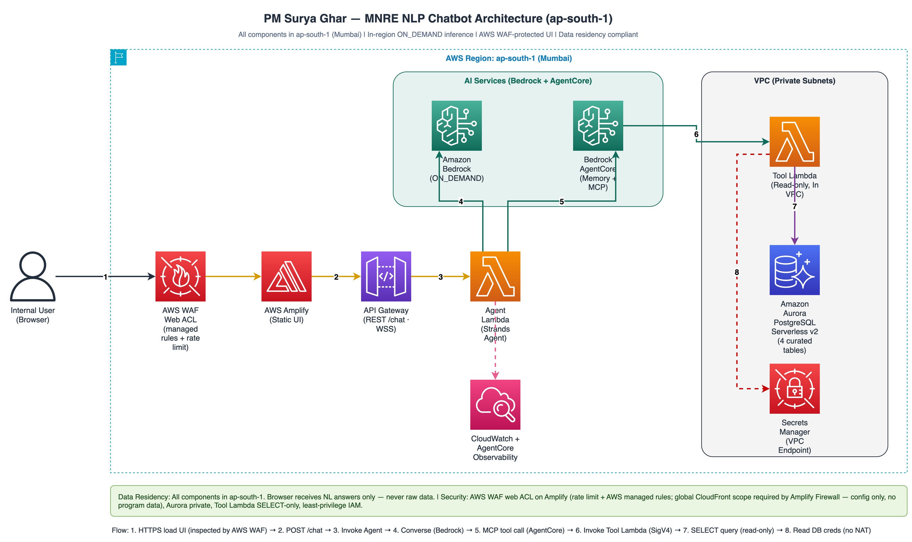

# MNRE AgentCore Chatbot — Architecture

How the chatbot works internally. Every component runs in `ap-south-1` (Mumbai);
the only component outside the Region is the user's browser, and it only ever
receives the final natural-language answer — never raw program data.

## System overview



```
Browser (Amplify static UI)
  → API Gateway  (REST /chat = demo · WebSocket = production)
    → Agent_Lambda (Strands agent, container image, OUT of VPC)
        ├─ Amazon Bedrock  (in-region ON_DEMAND model)              — reasons + phrases
        ├─ AgentCore Memory                                          — load/save session turns
        └─ AgentCore Gateway (MCP, SigV4 IAM)  →  Tool_Lambda (IN VPC)
                                                    → Aurora PostgreSQL (SELECT-only)
                                                    → Secrets Manager (VPC endpoint, no NAT)
  ← natural-language answer
CloudWatch + AgentCore Observability capture logs/traces throughout.
```

## Transports (REST for the demo, WebSocket for production)

The Agent_Lambda handler serves both entry points from one code path:

| Transport | When | How it reaches the agent | Notes |
|-----------|------|--------------------------|-------|
| REST API `POST /chat` | Demo (default) | API Gateway AWS_PROXY → synchronous request/response | Simple; no 29s ceiling issue for the ~3-16s queries. What `deploy.py` wires by default. |
| WebSocket API (`wss://`) | Production | `$connect`/`$disconnect` helpers + `sendMessage`/`$default` → agent; answer returned via `@connections` | Full duplex, no HTTP timeout coupling. The agent returns 200 immediately and re-invokes itself asynchronously to run the loop, then posts the answer to the originating connection. Deploy with `deploy.py --with-websocket`. |

Both are regional `ap-south-1` endpoints — no CloudFront (a global service) anywhere.

## Components

| Component | File | Model / Runtime | Purpose |
|-----------|------|-----------------|---------|
| Browser UI | `ui/index.html` | static HTML/JS (Amplify) | Dashboard + chat box; POSTs questions, renders answers |
| Agent_Lambda | `src/agent/handler.py` | container image, out-of-VPC | Strands agent: interprets question, calls tools, phrases answer |
| Bedrock model | (invoked by agent) | `mistral.mistral-large-3-675b-instruct` ON_DEMAND (default; configurable) | Reasoning + tool selection + answer phrasing |
| AgentCore Gateway | `infra/agentcore_setup.py` | MCP server, AWS_IAM auth | Exposes 4 read-only `query_<table>` tools to the agent |
| Tool_Lambda | `src/tool/handler.py` | zip, in-VPC | The only DB client: validate → build safe SQL → execute |
| Aurora PostgreSQL | `infra/provision_aurora.py` | Serverless v2, private | Holds the 4 curated tables |
| AgentCore Memory | `infra/agentcore_setup.py` | short-term conversational | Remembers session turns for follow-ups |
| Secrets Manager | (VPC interface endpoint) | — | Holds the read-only DB credential |

## Agent internals

| Module | File | Responsibility |
|--------|------|----------------|
| Handler | `src/agent/handler.py` | Event routing (REST/WS/direct), turn orchestration, answer cleanup |
| Prompt | `src/agent/prompt.py` | System prompt describing the 4 tables + how to map NL → query shape |
| Memory | `src/agent/memory.py` | Load/save conversational turns via AgentCore Memory events |
| Residency guard | `src/agent/residency.py` | Fail-fast on cross-region model ids (`us.*`/`eu.*`/`ap.*`/`apac.*`/`jp.*`/`au.*`/`global.*`) |
| SigV4 auth | `src/agent/sigv4.py` | `httpx.Auth` that signs MCP-over-HTTP for `bedrock-agentcore` |
| Errors | `src/agent/errors.py` | Never-raising wrapper → always returns a polite answer |

## Tool internals (the safety core)

| Module | File | Responsibility |
|--------|------|----------------|
| Schema | `src/common/schema.py` | Single source of truth: 4 tables, 30 curated typed columns, per-table whitelist, DDL |
| Validate | `src/tool/validate.py` | Reject unknown table/column/op/fn or any raw-SQL key; run nothing on violation |
| Query builder | `src/tool/query_builder.py` | SELECT-only, whitelist-only identifiers, every literal bound as `%s` |
| Response | `src/tool/response.py` | Shape rows to JSON; redact DB credentials from logs |
| Handler | `src/tool/handler.py` | Read-only Aurora connection, execute, shape |

## Detailed flow — one question

```
1. Browser POST /chat {question, sessionId}
2. API Gateway → Agent_Lambda (_handle_http)
3. residency_guard(MODEL_ID)                         # cross-region prefix → hard fail
4. Memory.load(actorId, sessionId)  ── prior turns ──► system-prompt context
5. Strands Agent + BedrockModel(in-region modelId, streaming=False)
       The model decides: query_<table> + {filters, group_by, aggregations, order_by, having, limit}
6. MCP call (SigV4) → AgentCore Gateway → Tool_Lambda
       validate_request()  → reject on any violation (no query built)
       build_query()       → SELECT ... %s ... (whitelist identifiers, bound literals)
       psycopg (readonly=True) → Aurora → rows
       shape_response()    → {table,row_count,columns,rows,truncated}   (creds redacted in logs)
7. rows → agent → the model phrases a plain-English answer
8. _clean_answer()         # strip any leaked "the query on the 'X' table shows…"
9. Memory.save(question, answer)
10. answer → HTTP response → browser renders
```

## Request workflow (step by step)

The one-line version:

```
Browser → API Gateway (REST /chat) → Agent_Lambda → Bedrock (in-region model) + AgentCore Memory
         → AgentCore Gateway (MCP/SigV4) → Tool_Lambda (in-VPC) → Aurora → back up the chain → answer
```

1. Ask (browser). The user types a question in the Amplify-hosted page
   (`ui/index.html`). JavaScript does a `fetch()` POST to the REST endpoint with
   `{question, sessionId}`. `sessionId` is a random per-page id so follow-ups
   stay in one conversation.
2. Front door (API Gateway REST). `POST /chat` is an `AWS_PROXY` integration
   that hands the request straight to Agent_Lambda. (`OPTIONS /chat` is a CORS
   preflight so the browser fetch is allowed.)
3. Agent_Lambda wakes up (`src/agent/handler.py`). It detects the HTTP-proxy
   shape and calls `_handle_http`, which pulls out `question` and `sessionId`
   and runs one "turn." At cold start, `residency_guard(MODEL_ID)` has already
   run — it hard-fails if anyone configured a cross-region inference-profile id
   (`us.*`/`eu.*`/`ap.*`/`apac.*`/`jp.*`/`au.*`/`global.*`), guaranteeing
   in-region inference.
4. Recall context (AgentCore Memory). `memory.load()` fetches the prior turns
   for this `(actor, session)` from AgentCore Memory, oldest-first, and folds
   them into the system prompt. That is what makes "…and in Gujarat?" work as a
   follow-up.
5. Reason (Bedrock, in-region ON_DEMAND). The handler builds a Strands `Agent` with
   the system prompt (from `prompt.py` — it describes the 4 tables and how to map
   a question to a query shape) and an MCP client pointed at the AgentCore
   Gateway. The model reads the question and decides which tool to call and with
   what arguments — e.g. "call `query_applications`, group by state, count, sort
   desc, limit 5." The model does not see the database; it only picks a tool and
   parameters.
6. Tool call over MCP + SigV4 (`sigv4.py`). The tool call travels as an
   MCP-over-HTTP request to the Gateway. Every such request is SigV4-signed for
   service `bedrock-agentcore` using the Lambda's IAM role. The Gateway has
   `authorizerType=AWS_IAM`, so an unsigned caller is rejected — the agent can't
   reach the tools any other way.
7. Gateway → Tool_Lambda. The AgentCore Gateway exposes exactly 4 read-only
   tools (`query_applications/subsidy/installation/inspection`). It forwards the
   model's structured request to Tool_Lambda, with the `table` pinned per tool.
   Tool_Lambda is the only component inside the private VPC.
8. Safe execution (`src/tool/`). This is the security core:
   - `validate.py` — rejects anything not on the whitelist (unknown
     table/column/operator/function, or a smuggled raw-SQL key). On any
     violation it returns an error and runs nothing.
   - `query_builder.py` — builds a `SELECT`-only statement where every
     identifier comes from the whitelist and every value is bound as a `%s`
     parameter. SQL injection and writes are structurally impossible.
   - `handler.py` — reads the read-only DB credential from Secrets Manager via a
     VPC endpoint (no NAT), connects to Aurora as a `readonly` user with
     `set_session(readonly=True)`, executes, and shapes the rows. Credentials
     are redacted from all logs.
9. Query Aurora. Aurora PostgreSQL (private, in the VPC) runs the parameterized
   `SELECT` and returns the rows.
10. Rows flow back up. Aurora → Tool_Lambda → Gateway → Agent. The agent hands
    the real numbers back to the model, which phrases a clean, plain-English
    answer. `_clean_answer()` strips any leaked "the query on the 'X' table
    shows…" phrasing so the user sees business language, not query mechanics.
11. Remember + reply. `memory.save()` writes this (question, answer) turn back
    to AgentCore Memory, and the answer is returned in the HTTP response body.
    The browser renders it.

Two guarantees this flow gives you:

- No hallucinated numbers: every figure in an answer came from a live Aurora
  query. If the data can't answer, the bot says so instead of guessing.
- No data leaves the Region: every hop — API Gateway, Lambda, Bedrock (in-region
  ON_DEMAND), AgentCore, Aurora, Secrets Manager — is in `ap-south-1`. The only
  thing outside is the browser, and it only ever receives the final answer text.

## Data schema (curated, shared by all 4 tables)

The four source datasets are lifecycle snapshots of the same PM Surya Ghar
record, so one curated schema (`src/common/schema.py`) applies to all four:
`applications`, `subsidy`, `installation`, `inspection`. 30 columns spanning
identifiers, geography, classification, vendor, bank, status/stage, monetary
(numeric), quantity, flags (boolean), and dates. `application_id` is the primary
key. The same module drives the loader's type coercion, the DDL, and the
Tool_Lambda whitelist — so they can never drift.

## Behavioral notes

- No raw SQL is ever possible: the LLM can only call 4 pre-approved read-only
  tools through an authenticated gateway; every query is whitelist-built and
  parameterized, so SQL injection and writes are structurally impossible.
- No hallucination: every number comes from a live query. If the data can't
  answer, the bot says so.
- Data residency: everything in `ap-south-1`; Bedrock invoked in-region
  ON_DEMAND (guarded); no CloudFront.
- The agent handler never raises: any tool/model failure returns a polite
  "couldn't answer" message (`errors.wrap_tool_error`).

## Design rationale — why a custom tool layer (not Bedrock Knowledge Bases)

Amazon Bedrock Knowledge Bases were evaluated as a managed alternative to the
custom Tool_Lambda + AgentCore Gateway layer. None of the three KB source types
fit this use case:

| Bedrock KB option | Why it does not fit here |
|-------------------|--------------------------|
| Structured datastore (NL→SQL) | Requires Amazon Redshift as the data source. The program data lives in Aurora PostgreSQL; adding Redshift means data migration or a parallel warehouse — extra cost and operational surface for no functional gain. It would also generate SQL rather than restrict to a whitelist, weakening the governance story. |
| Vector store | Semantic similarity retrieval. This data is precise structured records (counts, disbursement totals, fraud flags) that need exact SQL aggregation, not fuzzy nearest-neighbour matches. Approximate retrieval is exactly the hallucination risk the design avoids. |
| Unstructured (S3 documents) | RAG over documents (PDF/text). It cannot compute an aggregate like "total tranche-1 disbursed by bank" — that is a SQL query, not a document lookup. |

The custom Tool_Lambda pattern is effectively a governed, hand-built text-to-SQL
layer that: (1) queries Aurora PostgreSQL directly — no Redshift, no migration,
no added cost; (2) returns exact numbers from live queries — no vector
approximation; and (3) is safer than any generated-SQL option because every
query is whitelist-built and parameterized. For an MHA-adjacent, residency- and
audit-sensitive engagement, "the model can only call four pre-approved read-only
tools" is a stronger, provable guarantee than "the model generates SQL we trust
to be safe." So the custom layer is the right design because of these
constraints, not despite them.

## Project structure

```
.
├── deploy.py                  # one-command orchestrator (prompts for account, preflight + all steps)
├── cleanup.py                 # destroy all deployed resources
├── deploy/
│   ├── codebuild-deploy.yaml  # one-click CloudFormation launcher (CodeBuild runs deploy.py from an S3 bundle)
│   ├── run_in_codebuild.sh    # CodeBuild entry point (runs deploy.py/cleanup.py from the unpacked bundle)
│   └── make_bundle.sh         # produces the clean mnre-chatbot.zip source bundle for handoff
├── deploy.config.example.json # partner config template (copy to deploy.config.json)
├── data/                      # synthetic sample CSVs (committed, no real PII)
├── src/
│   ├── agent/                 # Strands agent, memory, prompt, residency, sigv4, errors
│   ├── common/                # schema.py — single source of truth
│   └── tool/                  # validate, query_builder, response, handler
├── loader/                    # pure coercion/projection logic
├── infra/
│   ├── config.py              # single source of per-account settings
│   ├── provision_network.py   # fresh VPC + subnets + SGs + VPC endpoints
│   ├── provision_aurora.py / wait_aurora.py
│   ├── provision_iam_ddb.py
│   ├── deploy_bootstrap.py / bootstrap_db/   # tables + read-only user
│   ├── deploy_loader.py / load_db/           # bulk-load sample data
│   ├── deploy_tool.py         # Tool_Lambda (in-VPC)
│   ├── agentcore_setup.py     # Gateway + Memory
│   ├── deploy_agent.py        # Agent_Lambda container image
│   ├── provision_rest_api.py  # REST /chat (demo)
│   ├── provision_websocket.py # WebSocket API (production)
│   └── deploy_amplify.py      # host UI on Amplify (injects REST URL)
├── tools/make_sample_data.py  # synthetic data generator
└── ui/index.html              # dashboard + chat
```

## Documentation

| Doc | Purpose |
|-----|---------|
| [README.md](README.md) | What it does, how to use it |
| [ARCHITECTURE.md](ARCHITECTURE.md) | How it works internally |
| [DEPLOYMENT.md](DEPLOYMENT.md) | Setup, deploy, teardown |
